# 操作步骤
1. 前端页面托管在9001端口：在12-4上起服务http-server -p 9001
2. 后端JSONP数据服务在8082端口：在data/jsonp.js上起http-server -p 8082
3. jsopn.js执行window上挂载的方法

## JSONP工作原理流程图

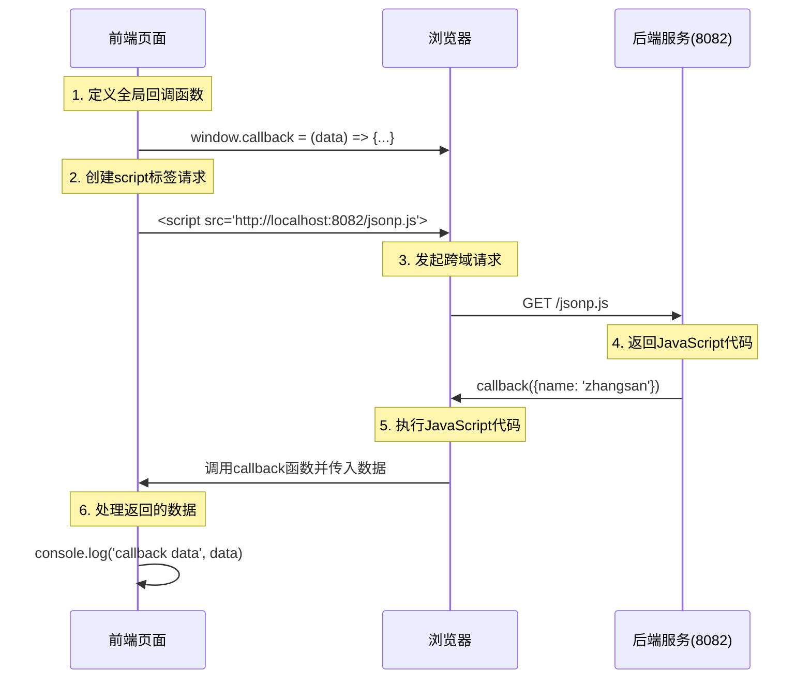

## CORS核心原理流程图

### 简单请求流程
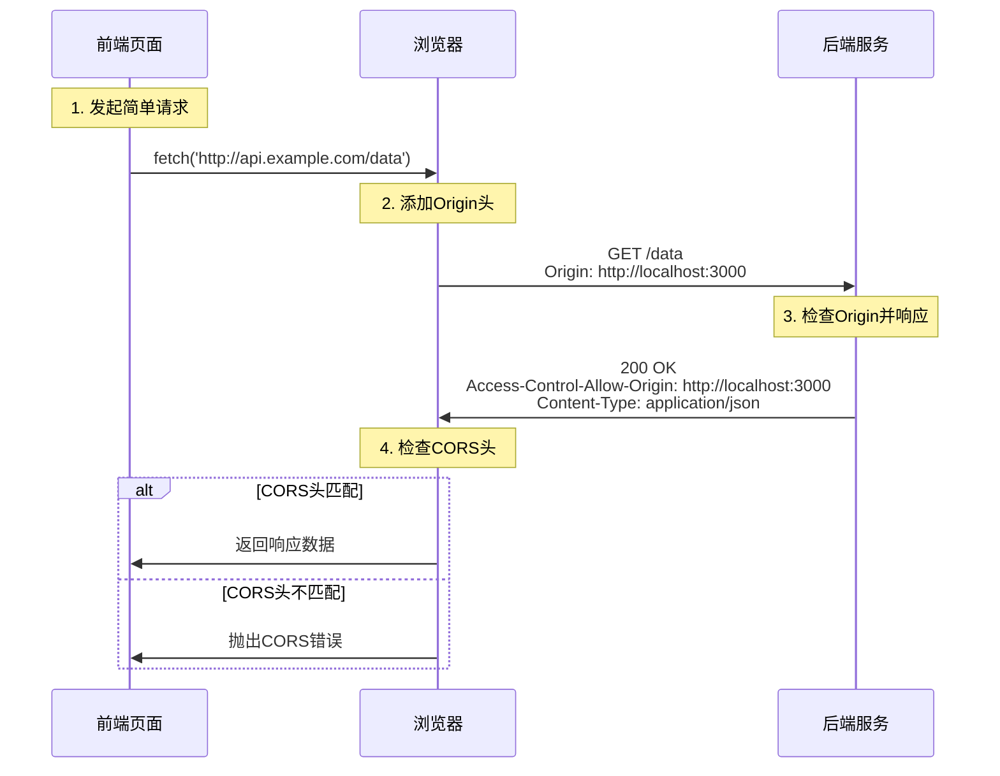

### 预检请求流程（复杂请求）
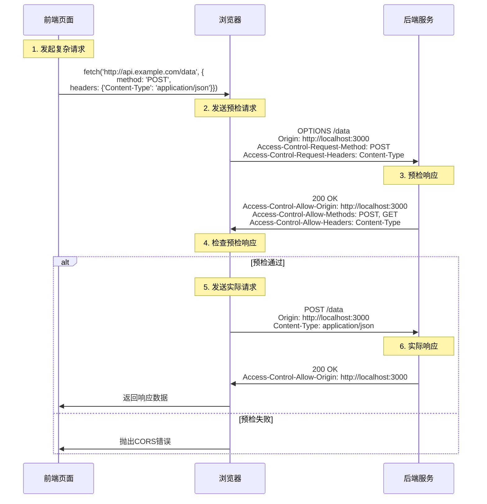

## 关于callback的来源说明

`data/jsonp.js`中的`callback`来自于前端的定义：

- **在`jsonp.html`中**：通过`window.callback = (data) => {...}`定义了全局回调函数
- **在`jqueryJsonp.html`中**：通过jQuery的`jsonpCallback: 'callback'`配置指定了回调函数名

**JSONP的工作原理**：
1. 前端定义一个全局回调函数（如`callback`）
2. 后端返回的JavaScript代码调用这个回调函数并传入数据
3. 当浏览器执行这段JavaScript时，就会调用前端定义的回调函数

这就是为什么`data/jsonp.js`文件内容是`callback({name: 'zhangsan'})`的原因 - 它调用了前端定义的`callback`函数。

## JSONP vs CORS 对比

| 特性 | JSONP | CORS |
|------|-------|------|
| 支持的HTTP方法 | 仅GET | 支持所有HTTP方法 |
| 数据格式 | 仅JavaScript | 支持各种数据格式 |
| 错误处理 | 困难 | 完善的错误处理 |
| 安全性 | 较低（执行任意JS代码） | 较高（浏览器安全检查） |
| 浏览器支持 | 所有浏览器 | 现代浏览器 |
| 实现复杂度 | 简单 | 需要服务端配置 |

## 深入理解CORS - 常见问题解答

### 问题1：浏览器如何判断简单请求vs复杂请求？

浏览器通过以下条件判断是否为**简单请求**，如果不满足则需要**预检请求**：

#### 简单请求的条件（必须同时满足）：

1. **HTTP方法**必须是以下之一：
   - `GET`
   - `HEAD`
   - `POST`

2. **请求头**只能包含以下字段：
   - `Accept`
   - `Accept-Language`
   - `Content-Language`
   - `Content-Type`（仅限于以下值）
   - `DPR`
   - `Downlink`
   - `Save-Data`
   - `Viewport-Width`
   - `Width`

3. **Content-Type**（如果存在）只能是：
   - `text/plain`
   - `multipart/form-data`
   - `application/x-www-form-urlencoded`

#### 触发预检请求的情况（复杂请求）：

```javascript
// 以下情况都会触发预检请求

// 1. 使用了非简单HTTP方法
fetch('/api/data', { method: 'PUT' })

// 2. 包含自定义请求头
fetch('/api/data', {
  headers: { 'X-Custom-Header': 'value' }
})

// 3. Content-Type为application/json
fetch('/api/data', {
  method: 'POST',
  headers: { 'Content-Type': 'application/json' },
  body: JSON.stringify({data: 'test'})
})

// 4. 包含认证信息
fetch('/api/data', { credentials: 'include' })
```

### 问题2：GET请求和跨域策略

**重要澄清**：GET请求**仍然受到跨域策略限制**！

#### 常见误解的原因：

1. **浏览器地址栏访问**：直接在地址栏输入URL不受同源策略限制
2. **HTML标签**：``, `<script>`, `<link>` 等标签可以跨域请求资源
3. **表单提交**：简单的表单提交可以跨域

#### 实际情况：

```javascript
// 这个GET请求仍然受CORS限制
fetch('http://api.otherdomain.com/data')
  .then(response => response.json())  // 如果没有正确的CORS头，这里会报错
  .catch(err => console.log('CORS error:', err))

// 即使是简单的GET请求，服务器也必须返回正确的`Access-Control-Allow-Origin`头
// Access-Control-Allow-Origin: *
// 或者
// Access-Control-Allow-Origin: http://yourdomain.com
```

#### GET请求的特殊性：

- GET请求通常是**简单请求**，不需要预检
- 但仍需要服务器返回正确的`Access-Control-Allow-Origin`头
- 浏览器会阻止JavaScript获取跨域GET请求的响应

### 问题3：SameSite vs Access-Control-Allow-Credentials

这两个属性解决不同的安全问题：

#### SameSite Cookie属性

**作用**：防止CSRF攻击，控制Cookie在跨站点请求中的发送行为

```javascript
// 设置Cookie时指定SameSite属性
document.cookie = "sessionId=abc123; SameSite=Lax; Secure"

// 或在服务端设置
response.setHeader('Set-Cookie', 'sessionId=abc123; SameSite=Lax; Secure')
```

**SameSite选项**：
- `Strict`：仅在同站点请求中发送Cookie
- `Lax`（默认）：同站点请求 + 顶级导航（如点击链接）中发送
- `None`：所有请求中都发送（需要Secure属性）

#### Access-Control-Allow-Credentials

**作用**：允许跨域请求携带认证信息（Cookie、Authorization头等）

```javascript
// 后端设置
response.setHeader("Access-Control-Allow-Credentials", "true")
response.setHeader("Access-Control-Allow-Origin", "http://localhost:3000") // 不能是*

// 前端请求
fetch('http://api.example.com/data', {
  credentials: 'include'  // 携带Cookie
})
```

#### 两者的关系和区别：

| 特性 | SameSite | Access-Control-Allow-Credentials |
|------|----------|----------------------------------|
| **目的** | 防止CSRF攻击 | 允许跨域请求携带认证信息 |
| **作用域** | Cookie发送行为 | CORS跨域请求 |
| **默认值** | Lax | false |
| **安全重点** | 防止恶意网站利用用户身份 | 控制跨域资源访问权限 |

#### 实际应用场景：

```javascript
// 场景：前端(localhost:3000)请求API(localhost:8080)，需要携带登录Cookie

// 1. 后端设置CORS
app.use(cors({
  origin: 'http://localhost:3000',
  credentials: true  // 允许携带Cookie
}))

// 2. 设置Cookie时考虑SameSite
app.get('/login', (req, res) => {
  res.cookie('token', 'jwt-token', {
    sameSite: 'lax',    // 允许跨站点顶级导航携带
    secure: true,       // HTTPS环境
    httpOnly: true      // 防止XSS
  })
})

// 3. 前端发送请求
fetch('http://localhost:8080/api/user', {
  credentials: 'include'  // 携带Cookie
})
```

#### 总结：
- **SameSite**：Cookie层面的安全策略，防止CSRF
- **Access-Control-Allow-Credentials**：CORS层面的权限控制，允许跨域请求携带认证信息
- 两者配合使用可以在保证安全的前提下实现跨域认证

### 配置冲突案例：SameSite=Strict + Access-Control-Allow-Credentials=true

#### 冲突分析

当同时设置以下配置时会发生什么：

```javascript
// 后端设置
response.setHeader("Access-Control-Allow-Credentials", "true")
response.setHeader("Access-Control-Allow-Origin", "http://localhost:3000")

// Cookie设置为Strict
response.setHeader('Set-Cookie', 'sessionId=abc123; SameSite=Strict; Secure')

// 前端发起跨域请求
fetch('http://localhost:8080/api/data', {
  credentials: 'include'  // 尝试携带Cookie
})
```

#### 实际结果：

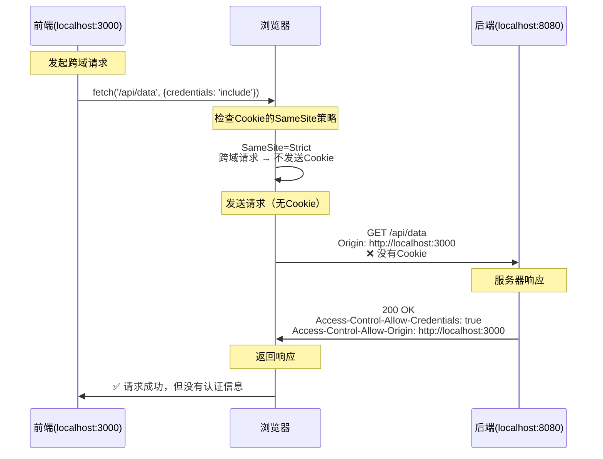

#### 关键问题：

1. **Cookie不会被发送**：尽管后端允许携带认证信息，但`SameSite=Strict`阻止了Cookie在跨域请求中发送
2. **认证失败**：服务器无法获取到用户的认证信息
3. **配置矛盾**：两个设置的目的相互冲突

#### 正确的配置组合：

```javascript
// ✅ 推荐配置1：允许跨域认证
app.use(cors({
  origin: 'http://localhost:3000',
  credentials: true
}))

app.get('/login', (req, res) => {
  res.cookie('token', 'jwt-token', {
    sameSite: 'none',    // 允许跨站点发送
    secure: true,        // 必须配合None使用
    httpOnly: true
  })
})

// ✅ 推荐配置2：同域认证
app.use(cors({
  origin: 'http://localhost:3000',
  credentials: true
}))

app.get('/login', (req, res) => {
  res.cookie('token', 'jwt-token', {
    sameSite: 'lax',     // 允许部分跨站点场景
    secure: true,
    httpOnly: true
  })
})
```

#### SameSite配置建议：

| 场景 | SameSite配置 | 说明 |
|------|-------------|------|
| **纯同域应用** | `Strict` | 最高安全性，只允许同站点请求 |
| **跨子域认证** | `Lax` | 允许顶级导航，适合多子域场景 |
| **跨域API调用** | `None` + `Secure` | 允许所有跨站点请求，需HTTPS |
| **混合场景** | `Lax` | 平衡安全性和兼容性 |

#### 调试方法：

```javascript
// 前端调试：检查请求是否携带Cookie
fetch('http://localhost:8080/api/data', {
  credentials: 'include'
})
.then(response => {
  console.log('请求头:', response.headers)
  return response.json()
})

// 后端调试：检查是否收到Cookie
app.get('/api/data', (req, res) => {
  console.log('收到的Cookie:', req.cookies)
  console.log('请求头:', req.headers)
  
  if (!req.cookies.sessionId) {
    return res.status(401).json({error: '未携带认证Cookie'})
  }
  
  res.json({data: 'success'})
})
```

#### 总结：
- **SameSite=Strict + 跨域认证 = 冲突**
- Cookie策略优先级高于CORS配置
- 必须根据实际应用场景选择合适的SameSite值
- 使用开发者工具Network面板检查Cookie是否被发送

### 配置冲突案例2：SameSite=None + Access-Control-Allow-Credentials=false

#### 冲突分析

当同时设置以下配置时的情况：

```javascript
// 后端设置 - 不允许携带认证信息
response.setHeader("Access-Control-Allow-Credentials", "false") // 或者不设置此头
response.setHeader("Access-Control-Allow-Origin", "*") // 可以使用通配符

// Cookie设置 - 允许跨站点发送
response.setHeader('Set-Cookie', 'sessionId=abc123; SameSite=None; Secure')

// 前端发起跨域请求
fetch('http://localhost:8080/api/data', {
  credentials: 'include'  // 尝试携带Cookie
})
```

#### 实际结果：

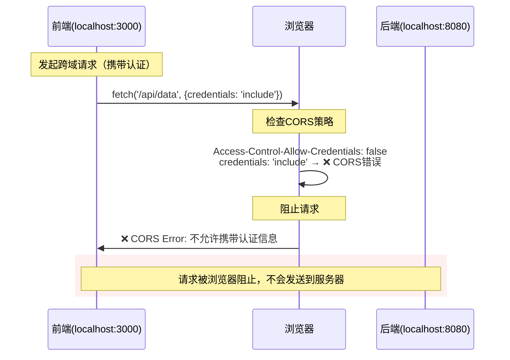

#### 不同前端配置的结果：

**场景1：前端明确要求携带认证信息**
```javascript
// ❌ 这会导致CORS错误
fetch('http://localhost:8080/api/data', {
  credentials: 'include'
})
// 错误信息：Access to fetch at 'http://localhost:8080/api/data' 
// has been blocked by CORS policy: The value of the 'Access-Control-Allow-Credentials' 
// header in the response is '' which must be 'true' when the request's credentials mode is 'include'.
```

**场景2：前端不携带认证信息**
```javascript
// ✅ 这个请求会成功
fetch('http://localhost:8080/api/data')
// 或者
fetch('http://localhost:8080/api/data', {
  credentials: 'omit'  // 明确不携带认证信息
})
```

#### 关键问题：

1. **CORS策略优先**：即使Cookie策略允许跨站点发送，CORS不允许就会被阻止
2. **请求被完全阻止**：与前一个案例不同，这次连HTTP请求都发不出去
3. **错误信息明确**：浏览器会抛出明确的CORS错误信息

#### 实际应用场景对比：

```javascript
// ❌ 矛盾配置：Cookie允许跨站点，但CORS不允许携带
app.use(cors({
  origin: '*',
  credentials: false    // 不允许携带认证信息
}))

app.get('/login', (req, res) => {
  res.cookie('token', 'jwt-token', {
    sameSite: 'none',   // 允许跨站点发送（但永远不会被发送）
    secure: true,
    httpOnly: true
  })
})

// ✅ 正确配置1：公开API，不需要认证
app.use(cors({
  origin: '*',
  credentials: false
}))

app.get('/public-data', (req, res) => {
  // 不设置任何认证Cookie，或者设置非认证Cookie
  res.cookie('preferences', 'theme=dark', {
    sameSite: 'lax',    // 不需要跨站点发送
    secure: true
  })
  res.json({data: 'public information'})
})

// ✅ 正确配置2：需要认证的跨域API
app.use(cors({
  origin: 'http://localhost:3000',  // 不能使用通配符
  credentials: true                 // 允许携带认证信息
}))

app.get('/login', (req, res) => {
  res.cookie('token', 'jwt-token', {
    sameSite: 'none',   // 允许跨站点发送
    secure: true,       // HTTPS必需
    httpOnly: true
  })
})
```

#### 调试技巧：

```javascript
// 前端：处理不同的错误情况
async function fetchData() {
  try {
    const response = await fetch('http://localhost:8080/api/data', {
      credentials: 'include'
    })
    
    if (!response.ok) {
      throw new Error(`HTTP error! status: ${response.status}`)
    }
    
    const data = await response.json()
    console.log('成功获取数据:', data)
    
  } catch (error) {
    if (error.name === 'TypeError' && error.message.includes('CORS')) {
      console.error('CORS错误 - 检查服务器的Access-Control-Allow-Credentials设置')
    } else {
      console.error('其他错误:', error)
    }
  }
}

// 后端：提供清晰的错误信息
app.use((req, res, next) => {
  console.log('请求头:', {
    origin: req.headers.origin,
    cookies: req.headers.cookie,
    credentials: req.headers.credentials
  })
  next()
})
```

#### 配置决策表：

| 需求场景 | SameSite | Secure | Access-Control-Allow-Credentials | Origin |
|----------|----------|--------|----------------------------------|--------|
| **公开API，无认证** | `Lax` | `true` | `false` | `*` |
| **跨域认证API** | `None` | `true` | `true` | 具体域名 |
| **同域认证** | `Strict` | `true` | `true` | 具体域名 |
| **开发环境（HTTP）** | `Lax` | `false` | `true` | 具体域名 |

#### 总结：
- **SameSite=None + Credentials=false = 资源浪费**
- CORS策略比Cookie策略优先级更高
- 矛盾配置会导致明确的错误信息
- 合理规划认证策略，避免无效配置

## 深入分析：SameSite=Lax 的跨域行为

### 问题1：SameSite=Lax 在跨域请求中的Cookie携带规则

您的理解**完全正确**！`SameSite=Lax` 确实只在特定情况下允许跨站点发送Cookie：

#### SameSite=Lax 允许发送Cookie的场景：

```javascript
// ✅ 允许携带Cookie的情况

// 1. GET请求 + 顶级导航（用户点击链接）
<a href="http://api.example.com/profile">查看资料</a>

// 2. GET请求 + 表单提交
<form method="GET" action="http://api.example.com/search">
  <input type="text" name="q" />
  <button type="submit">搜索</button>
</form>

// 3. POST请求 + 表单提交（非AJAX）
<form method="POST" action="http://api.example.com/login">
  <input type="text" name="username" />
  <input type="password" name="password" />
  <button type="submit">登录</button>
</form>
```

#### SameSite=Lax 不允许携带Cookie的场景：

```javascript
// ❌ 不会携带Cookie的情况

// 1. AJAX/Fetch请求（即使是GET）
fetch('http://api.example.com/data', {
  credentials: 'include'  // Cookie不会被发送
})

// 2. XMLHttpRequest
const xhr = new XMLHttpRequest()
xhr.withCredentials = true
xhr.open('GET', 'http://api.example.com/data')
xhr.send()  // Cookie不会被发送

// 3. 图片、脚本、样式等资源请求
 // 不携带Cookie

// 4. iframe内的请求
<iframe src="http://api.example.com/widget"></iframe> // 不携带Cookie
```

#### 实际测试场景：

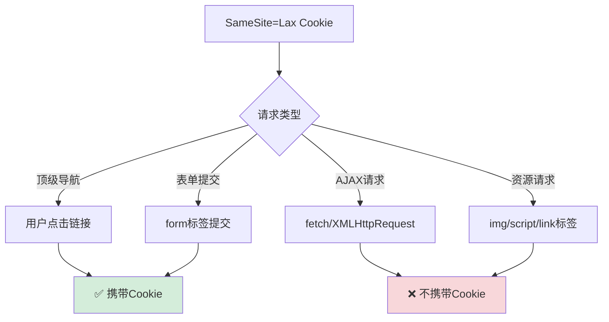

## 完整流程：浏览器安全检查的执行顺序

### 问题2：CORS + Cookie 检查的先后顺序

浏览器的安全检查有严格的执行顺序：

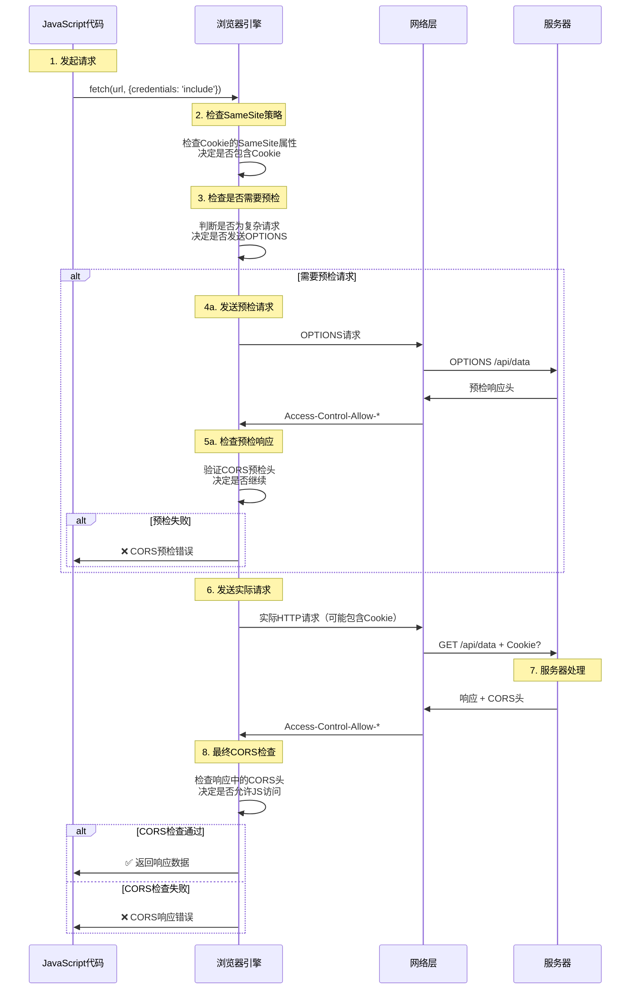

### 详细的检查顺序：

#### 第1步：前端发起请求
```javascript
fetch('http://api.example.com/data', {
  credentials: 'include'  // 告诉浏览器要携带认证信息
})
```

#### 第2步：浏览器检查SameSite策略
```javascript
// 浏览器内部逻辑（伪代码）
if (cookie.sameSite === 'strict' && isCrossSite) {
  // 不包含Cookie
} else if (cookie.sameSite === 'lax' && isCrossSite && !isTopLevelNavigation) {
  // 不包含Cookie
} else if (cookie.sameSite === 'none' && !cookie.secure) {
  // 不包含Cookie（None必须配合Secure）
} else {
  // 包含Cookie
}
```

#### 第3步：检查是否需要预检请求
```javascript
// 如果是复杂请求，先发送OPTIONS预检
if (isComplexRequest) {
  sendPreflightRequest()
}
```

#### 第4步：发送实际请求
```javascript
// 请求可能包含或不包含Cookie，取决于第2步的结果
const request = {
  method: 'GET',
  url: 'http://api.example.com/data',
  headers: {
    'Origin': 'http://localhost:3000'
  },
  // Cookie可能存在或不存在
  cookie: sameSiteCheckPassed ? 'sessionId=abc123' : undefined
}
```

#### 第5步：服务器响应
```javascript
// 服务器设置CORS头
response.setHeader('Access-Control-Allow-Origin', 'http://localhost:3000')
response.setHeader('Access-Control-Allow-Credentials', 'true')
```

#### 第6步：浏览器最终检查
```javascript
// 浏览器检查响应头
if (response.headers['access-control-allow-credentials'] === 'true' && 
    request.credentials === 'include' && 
    response.headers['access-control-allow-origin'] === '*') {
  // ❌ 错误：credentials为true时，origin不能为*
  throw new CORSError()
}
```

### 关键要点：

#### 1. **SameSite检查最优先**
- 在请求发送前就决定是否包含Cookie
- 由**浏览器端**执行，不需要服务器参与

#### 2. **CORS检查分两个阶段**
- **预检阶段**：复杂请求的OPTIONS检查
- **响应阶段**：检查实际响应的CORS头

#### 3. **错误发生的不同阶段**
```javascript
// 阶段1错误：SameSite阻止（静默，Cookie不发送）
// 无错误信息，Cookie简单不包含在请求中

// 阶段2错误：预检失败
// TypeError: Failed to fetch (CORS preflight error)

// 阶段3错误：响应CORS检查失败  
// Access to fetch has been blocked by CORS policy
```

#### 4. **拦截者都是浏览器**
- **所有检查都由浏览器执行**
- 服务器只负责设置响应头
- 浏览器根据策略决定是否阻止请求或响应

### 实际调试建议：

```javascript
// 调试SameSite问题
console.log('发送请求前的Cookie:', document.cookie)

fetch('http://api.example.com/data', {
  credentials: 'include'
})
.then(response => {
  console.log('请求成功，但检查服务器是否收到Cookie')
  return response.json()
})
.catch(error => {
  if (error.message.includes('CORS')) {
    console.log('CORS错误 - 检查服务器响应头')
  } else {
    console.log('其他错误:', error)
  }
})

// 服务器端调试
app.use((req, res, next) => {
  console.log('收到的Cookie:', req.headers.cookie)
  console.log('请求Origin:', req.headers.origin)
  next()
})
```

### 总结：
1. **SameSite=Lax 确实限制跨域AJAX请求携带Cookie**
2. **检查顺序**：SameSite → 预检CORS → 实际请求 → 响应CORS
3. **全程由浏览器控制**，服务器只提供配置
4. **理解顺序有助于精准定位问题**

## 深入理解：Access-Control-Allow-Origin vs Access-Control-Allow-Credentials

### 为什么两个配置都需要？它们控制不同的安全维度

很多开发者会有疑惑：既然已经设置了 `Access-Control-Allow-Origin` 指定具体域名，为什么还需要 `Access-Control-Allow-Credentials`？

#### 两个配置的不同职责：

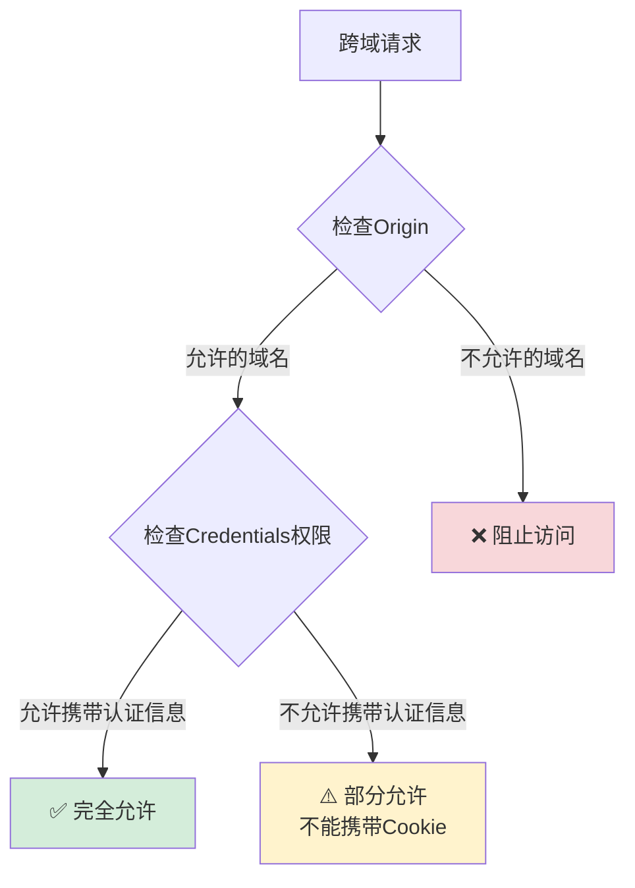

#### 实际场景对比：

**场景1：只设置 Origin，不设置Credentials**
```javascript
// 服务端配置
res.setHeader('Access-Control-Allow-Origin', 'http://localhost:8011')
// 没有设置 Access-Control-Allow-Credentials

// 前端请求
fetch('http://localhost:8080/api/data', {
  credentials: 'include'  // 尝试携带Cookie
})
```

**结果**：❌ **CORS错误** - 浏览器会阻止请求

```
Access to fetch at 'http://localhost:8080/api/data' from origin 'http://localhost:8011' 
has been blocked by CORS policy: The value of the 'Access-Control-Allow-Credentials' 
header in the response is '' which must be 'true' when the request's credentials mode is 'include'.
```

**场景2：正确配置两个头**
```javascript
// 服务端配置
res.setHeader('Access-Control-Allow-Origin', 'http://localhost:8011')
res.setHeader('Access-Control-Allow-Credentials', 'true')

// 前端请求
fetch('http://localhost:8080/api/data', {
  credentials: 'include'
})
```

**结果**：✅ **请求成功** - 可以携带Cookie

#### 详细的权限控制矩阵：

| Origin配置 | Credentials配置 | 前端credentials | 结果 | 说明 |
|-----------|----------------|----------------|------|------|
| `*` | `false` | `omit` | ✅ | 公开API，不携带认证 |
| `*` | `false` | `include` | ❌ | CORS错误：通配符不能携带认证 |
| `*` | `true` | `include` | ❌ | CORS错误：通配符不能携带认证 |
| `http://localhost:8011` | `false` | `omit` | ✅ | 允许访问，不携带认证 |
| `http://localhost:8011` | `false` | `include` | ❌ | CORS错误：明确禁止携带认证 |
| `http://localhost:8011` | `true` | `include` | ✅ | 完美配置：允许访问+携带认证 |

#### 为什么需要两个配置？

**1. 不同的安全关注点**

```javascript
// Access-Control-Allow-Origin 回答：谁能访问？
// - 控制哪些域名可以发起跨域请求
// - 防止恶意网站访问你的API

// Access-Control-Allow-Credentials 回答：能携带什么？
// - 控制是否允许携带用户的认证信息
// - 防止恶意网站利用用户的登录状态
```

**2. 默认的安全策略**

```javascript
// 浏览器的默认行为：
// 1. 跨域请求默认不携带Cookie（除非明确允许）
// 2. 即使Origin匹配，也需要明确授权才能携带认证信息

// 这是双重安全机制：
// 第一重：检查来源是否可信
// 第二重：检查是否允许携带敏感信息
```

#### 实际的安全意义：

**场景：企业内部API**
```javascript
// 企业可能有多个前端应用
res.setHeader('Access-Control-Allow-Origin', 'http://admin.company.com')

// 但只有特定应用才能携带用户认证信息
if (isAuthenticatedApp(request)) {
  res.setHeader('Access-Control-Allow-Credentials', 'true')
}
```

**场景：第三方API集成**
```javascript
// 允许第三方访问公开数据
res.setHeader('Access-Control-Allow-Origin', 'http://partner.com')
// 但不允许携带用户敏感信息
// 不设置 Access-Control-Allow-Credentials

// 第三方可以访问API，但无法获取用户的个人数据
```

#### 常见的错误配置：

**❌ 错误1：想当然认为Origin包含了Credentials权限**
```javascript
// 这样配置是不够的
res.setHeader('Access-Control-Allow-Origin', 'http://localhost:8011')
// 前端携带Cookie的请求仍然会失败
```

**❌ 错误2：通配符+认证信息**
```javascript
// 这样配置会导致错误
res.setHeader('Access-Control-Allow-Origin', '*')
res.setHeader('Access-Control-Allow-Credentials', 'true')
// 浏览器会拒绝这种配置
```

**✅ 正确配置：明确指定**
```javascript
// 正确的认证API配置
res.setHeader('Access-Control-Allow-Origin', 'http://localhost:8011')
res.setHeader('Access-Control-Allow-Credentials', 'true')

// 正确的公开API配置
res.setHeader('Access-Control-Allow-Origin', '*')
// 不设置 Credentials 头（默认为false）
```

#### 实际调试方法：

```javascript
// 后端：记录请求信息
app.use((req, res, next) => {
  console.log('Origin:', req.headers.origin)
  console.log('Cookie:', req.headers.cookie)
  console.log('Credentials模式:', req.headers['sec-fetch-credentials'] || '未知')
  next()
})

// 前端：测试不同配置
async function testCORS() {
  try {
    // 测试1：不携带认证信息
    const response1 = await fetch('http://localhost:8080/api/data')
    console.log('不携带认证:', response1.ok)
    
    // 测试2：携带认证信息
    const response2 = await fetch('http://localhost:8080/api/data', {
      credentials: 'include'
    })
    console.log('携带认证:', response2.ok)
    
  } catch (error) {
    console.error('CORS错误:', error.message)
  }
}
```

### 总结：
- **Access-Control-Allow-Origin**：控制"谁能访问"
- **Access-Control-Allow-Credentials**：控制"能否携带认证信息"  
- **两者是不同维度的安全控制，缺一不可**
- **浏览器采用双重验证机制，确保跨域安全**
- **即使Origin匹配，默认也不允许携带认证信息**

## 重要区别：浏览器直接导航 vs AJAX请求

### 问题1：为什么浏览器地址栏访问API时SameSite=Strict的Cookie仍然发送？

这是一个非常重要的概念误区！**浏览器直接导航不受CORS和SameSite限制**。

#### 关键区别对比：

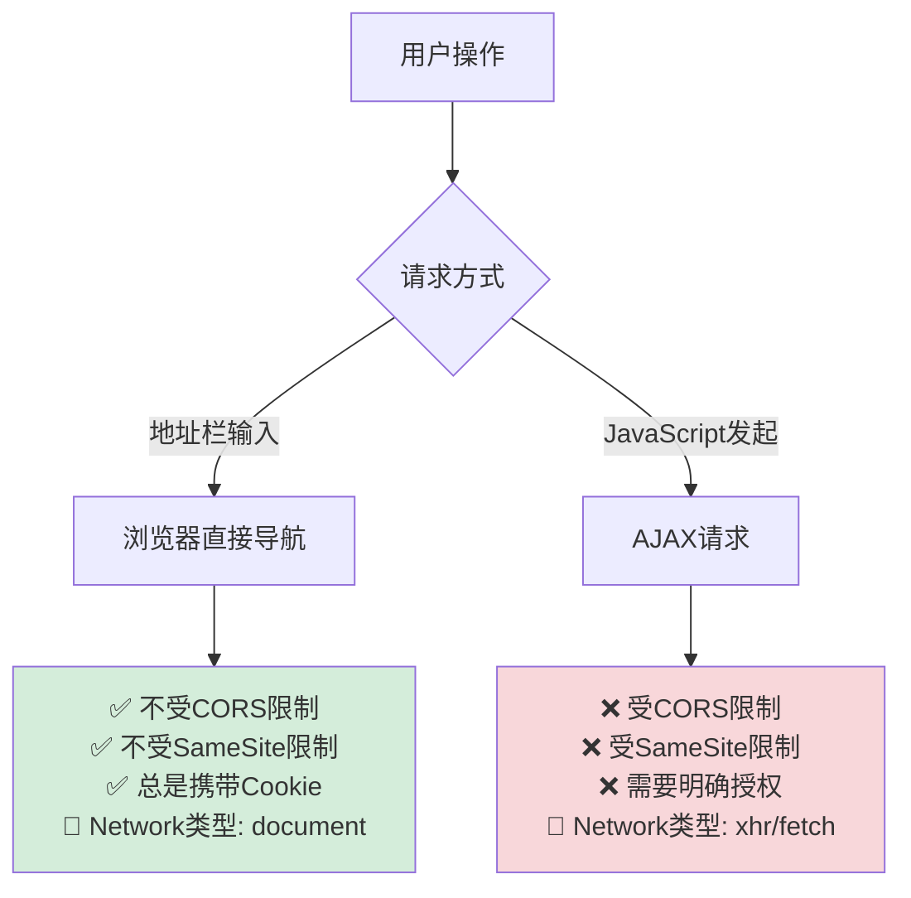

#### 实际测试场景：

**场景1：浏览器地址栏访问**
```javascript
// 在地址栏直接输入：
// http://api.co.id/data.json

// 结果：
// ✅ Cookie被发送（包括SameSite=Strict）
// ✅ 获取到数据
// ✅ Network面板显示 Type: document
// ✅ 不会有CORS错误
```

**场景2：JavaScript发起请求**
```javascript
// 在页面中执行：
fetch('http://api.co.id/data.json', {
  credentials: 'include'
})

// 结果：
// ❌ SameSite=Strict Cookie不会发送
// ❌ 可能遇到CORS错误
// ❌ Network面板显示 Type: xhr/fetch
```

#### 为什么会有这种差异？

**1. 浏览器直接导航被视为"用户主动行为"**
```javascript
// 浏览器的内部逻辑（伪代码）
if (isDirectNavigation) {
  // 用户主动访问，不受同源策略限制
  sendAllCookies = true
  ignoreCORS = true
  requestType = 'document'
} else if (isAJAXRequest) {
  // 脚本发起的请求，严格检查安全策略
  checkSameSite = true
  checkCORS = true
  requestType = 'xhr' || 'fetch'
}
```

**2. 不同的安全模型**
- **直接导航**：用户信任行为，浏览器完全放行
- **AJAX请求**：脚本发起，需要严格的安全检查

#### 详细的行为对比表：

| 特征 | 浏览器直接导航 | AJAX请求 |
|------|-------------|----------|
| **CORS检查** | ❌ 不检查 | ✅ 严格检查 |
| **SameSite限制** | ❌ 不限制 | ✅ 严格限制 |
| **Cookie发送** | ✅ 总是发送所有Cookie | ❌ 根据策略决定 |
| **Network类型** | `document` | `xhr` / `fetch` |
| **错误处理** | HTTP状态码 | CORS错误 + HTTP状态码 |
| **用户体验** | 页面跳转 | 异步数据获取 |

### 问题2：地址栏访问和点击链接是一个意思吗？

**完全正确！** 它们都属于**顶级导航**。

#### 顶级导航的定义：

```javascript
// 以下都是顶级导航，享受相同的安全豁免：

// 1. 地址栏直接输入
// 用户在地址栏输入：http://api.co.id/data.json

// 2. 点击链接
<a href="http://api.co.id/data.json">查看数据</a>

// 3. 表单提交（GET）
<form method="GET" action="http://api.co.id/data.json">
  <button type="submit">提交</button>
</form>

// 4. JavaScript location跳转
window.location.href = 'http://api.co.id/data.json'

// 5. 新窗口打开
window.open('http://api.co.id/data.json')
```

#### 顶级导航的共同特征：

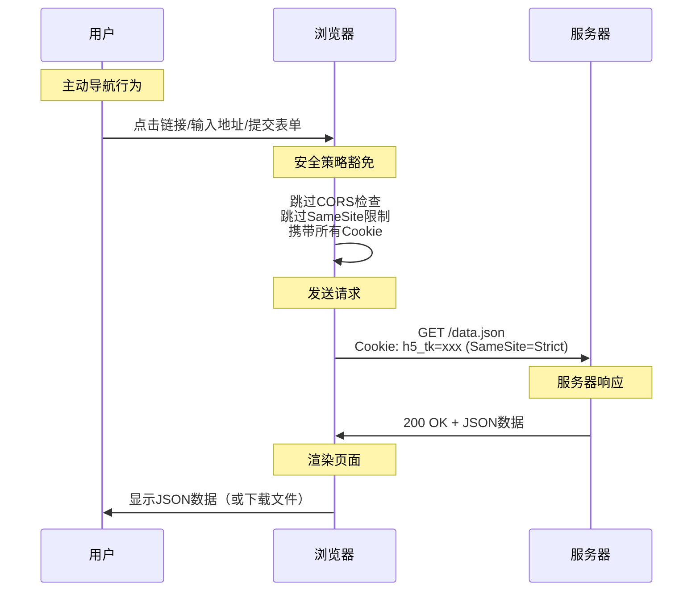

### 问题3：为什么地址栏无法访问POST请求？

**因为浏览器地址栏只能发送GET请求！**

#### HTTP方法的访问限制：

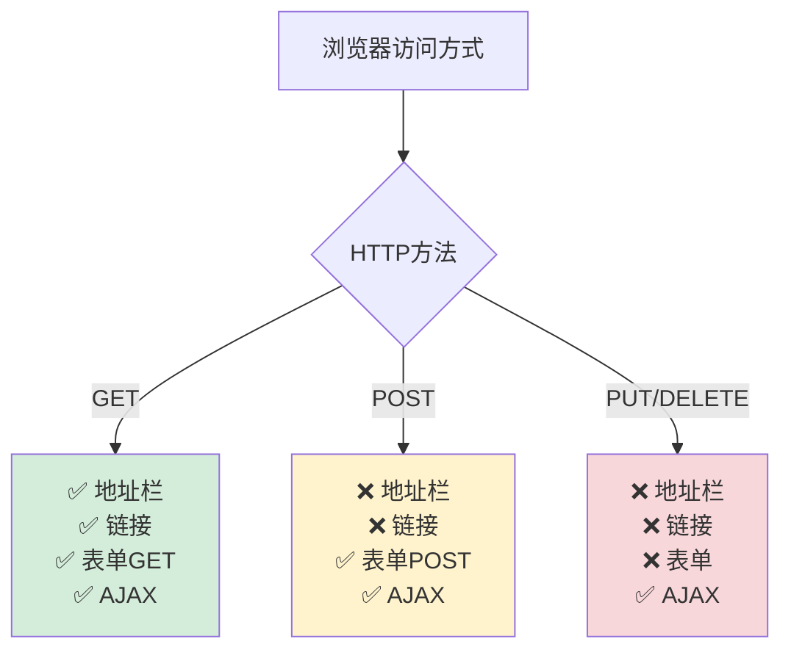

#### 为什么POST请求无法通过地址栏访问？

**1. HTTP协议限制**
```javascript
// 地址栏的本质是GET请求
// http://api.co.id/post/data.json
// 等同于：
// GET /post/data.json HTTP/1.1
// Host: api.co.id

// 无法通过URL指定其他HTTP方法
```

**2. 安全考虑**
```javascript
// 如果地址栏支持POST，会有安全问题：
// - 用户可能意外发送POST请求
// - 恶意链接可能触发数据修改操作
// - 浏览器历史记录可能包含敏感的POST数据
```

**3. 数据传输方式**
```javascript
// GET请求：数据在URL中
// http://api.co.id/data.json?id=123&name=test

// POST请求：数据在请求体中
// 地址栏无法指定请求体内容
```

#### 如何访问POST请求？

**方法1：使用表单**
```html
<form method="POST" action="http://api.co.id/post/data.json">
  <input type="hidden" name="data" value="test">
  <button type="submit">提交POST请求</button>
</form>
```

**方法2：使用AJAX**
```javascript
fetch('http://api.co.id/post/data.json', {
  method: 'POST',
  headers: {
    'Content-Type': 'application/json'
  },
  body: JSON.stringify({data: 'test'})
})
```

**方法3：使用开发者工具**
```javascript
// 在Console中执行：
fetch('http://api.co.id/post/data.json', {
  method: 'POST',
  credentials: 'include',
  headers: {'Content-Type': 'application/json'},
  body: JSON.stringify({test: 'data'})
})
```

#### 实际调试建议：

```javascript
// 如果需要测试POST API，可以：

// 1. 创建简单的HTML测试页面
const testHTML = `
<!DOCTYPE html>
<html>
<body>
  <button onclick="testPost()">测试POST</button>
  <script>
    async function testPost() {
      try {
        const response = await fetch('http://api.co.id/post/data.json', {
          method: 'POST',
          credentials: 'include',
          headers: {'Content-Type': 'application/json'},
          body: JSON.stringify({test: 'data'})
        })
        console.log('响应:', await response.json())
      } catch (error) {
        console.error('错误:', error)
      }
    }
  </script>
</body>
</html>
`

// 2. 或者使用浏览器插件如Postman
// 3. 或者使用curl命令行工具
```

### 关键总结：

1. **浏览器直接导航 ≠ AJAX请求**
   - 直接导航享受安全豁免
   - AJAX请求受严格限制

2. **SameSite=Strict 不影响顶级导航**
   - 地址栏访问、点击链接都会携带Cookie
   - 只有脚本发起的跨站请求才会被限制

3. **HTTP方法限制**
   - 地址栏只能发GET请求
   - POST/PUT/DELETE需要表单或AJAX

4. **Network面板的Type字段是重要线索**
   - `document`：浏览器导航
   - `xhr/fetch`：AJAX请求
