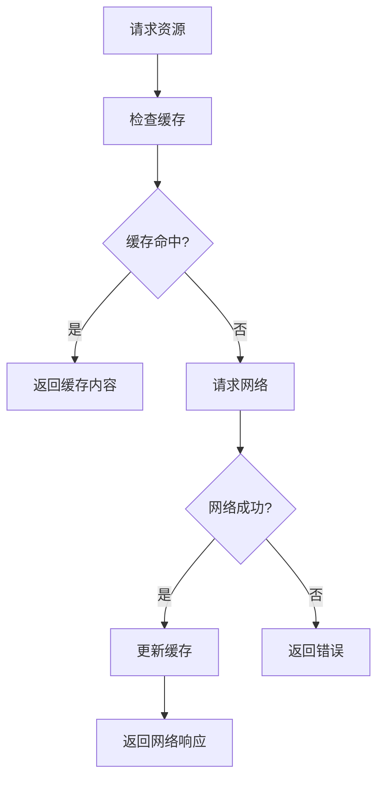
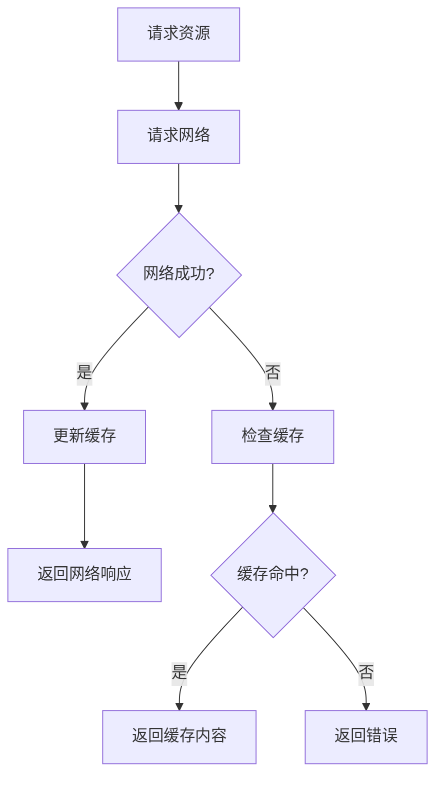
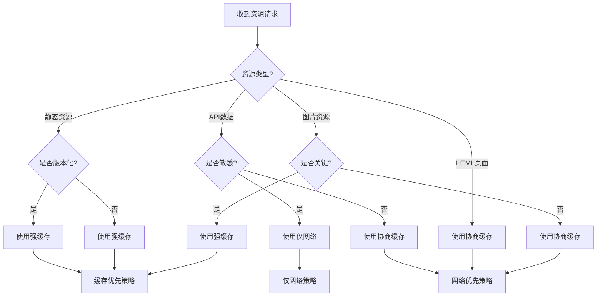

# Service Worker 缓存策略核心逻辑指南

## 🎯 核心概念

### 强缓存 vs 协商缓存

| 特性 | 强缓存 (Cache First) | 协商缓存 (Network First) |
|------|---------------------|-------------------------|
| **优先级** | 缓存优先 | 网络优先 |
| **适用场景** | 静态资源、版本化资源 | 动态内容、API 数据 |
| **数据实时性** | 较低 | 较高 |
| **加载速度** | 极快 | 较快 |
| **网络依赖** | 低 | 中等 |
| **缓存更新** | 手动或版本控制 | 自动更新 |

## 🔄 缓存策略执行流程

### 1. 强缓存策略 (Cache First)



**核心逻辑**：
1. **缓存优先**：首先检查缓存中是否有该资源
2. **快速响应**：缓存命中时立即返回，无需网络请求
3. **网络备用**：缓存未命中时才请求网络
4. **自动更新**：网络请求成功后自动更新缓存

**适用资源**：
- JavaScript 文件 (`bundle.js`, `vendor.js`)
- CSS 样式文件 (`main.css`, `theme.css`)
- 图片资源 (`logo.png`, `avatar.jpg`)
- 字体文件 (`font.woff2`, `icon.ttf`)
- 版本化资源 (`app.a1b2c3.js`)

### 2. 协商缓存策略 (Network First)



**核心逻辑**：
1. **网络优先**：首先尝试从网络获取最新数据
2. **实时更新**：网络成功时立即更新缓存
3. **缓存备用**：网络失败时使用缓存作为降级方案
4. **自动降级**：确保在网络不稳定时仍能提供服务

**适用资源**：
- API 接口数据 (`/api/users`, `/api/posts`)
- 动态内容 (用户信息、实时数据)
- HTML 页面 (可能包含动态内容)
- 配置信息 (系统配置、功能开关)

## 🎯 何时使用强缓存

### ✅ 推荐使用场景

#### 1. 静态资源文件
```javascript
// 这些资源变化频率低，适合强缓存
const staticResources = [
  '/static/js/bundle.js',      // JavaScript 文件
  '/static/css/main.css',      // CSS 文件
  '/static/images/logo.png',   // 图片文件
  '/static/fonts/font.woff2',  // 字体文件
  '/favicon.ico'               // 图标文件
];
```

#### 2. 版本化资源
```javascript
// 带 hash 的文件名，内容变化时文件名也会变化
const versionedResources = [
  'bundle.a1b2c3d4.js',        // 版本化 JS
  'main.e5f6g7h8.css',         // 版本化 CSS
  'logo.i9j0k1l2.svg'          // 版本化图片
];
```

#### 3. 第三方库文件
```javascript
// CDN 上的第三方库，版本稳定
const thirdPartyResources = [
  'https://cdn.jsdelivr.net/npm/react@18/umd/react.production.min.js',
  'https://cdn.jsdelivr.net/npm/bootstrap@5.1.3/dist/css/bootstrap.min.css',
  'https://cdn.jsdelivr.net/npm/lodash@4.17.21/lodash.min.js'
];
```

#### 4. 应用核心资源
```javascript
// 应用启动必需的关键资源
const coreResources = [
  '/',                    // 主页面
  '/manifest.json',       // 应用清单
  '/sw.js',              // Service Worker
  '/offline.html'        // 离线页面
];
```

### ❌ 不推荐使用场景

- 用户登录/注销接口
- 支付相关接口
- 实时聊天消息
- 动态配置信息
- 敏感数据接口

## 🔄 何时使用协商缓存

### ✅ 推荐使用场景

#### 1. API 接口数据
```javascript
// 需要实时性的 API 数据
const apiEndpoints = [
  '/api/users',           // 用户信息
  '/api/posts',           // 文章列表
  '/api/comments',        // 评论数据
  '/api/notifications',   // 通知信息
  '/api/analytics'        // 统计数据
];
```

#### 2. 动态内容
```javascript
// 用户生成或经常变化的内容
const dynamicContent = [
  '/user/profile',        // 用户个人资料
  '/dashboard',           // 仪表板数据
  '/feed',               // 动态信息流
  '/search?q=keyword'    // 搜索结果
];
```

#### 3. HTML 页面
```javascript
// 可能包含动态内容的页面
const htmlPages = [
  '/',                    // 首页
  '/user/:id',           // 用户页面
  '/post/:id',           // 文章页面
  '/category/:name'      // 分类页面
];
```

#### 4. 配置和元数据
```javascript
// 可能变化的配置信息
const configData = [
  '/api/config',         // 应用配置
  '/api/features',       // 功能开关
  '/api/system',         // 系统信息
  '/api/version'         // 版本信息
];
```

### ❌ 不推荐使用场景

- 静态资源文件
- 版本化资源
- 第三方库文件
- 应用核心资源

## ⚙️ 配置最佳实践

### 1. 资源分类配置

```javascript
const CACHE_CONFIG = {
  // 强缓存资源 - 长期缓存
  STRONG_CACHE: {
    patterns: [/\.(js|css|png|jpg|svg|woff2)$/, /\/static\//],
    ttl: 30 * 24 * 60 * 60 * 1000, // 30天
    maxEntries: 100,
    strategy: 'cache-first'
  },
  
  // 协商缓存资源 - 短期缓存
  NEGOTIATED_CACHE: {
    patterns: [/^\/api\//, /\.html$/],
    ttl: 5 * 60 * 1000, // 5分钟
    maxEntries: 50,
    strategy: 'network-first'
  },
  
  // 敏感操作 - 不缓存
  SENSITIVE: {
    patterns: [/\/auth\//, /\/payment\//, /\/admin\//],
    ttl: 0,
    maxEntries: 0,
    strategy: 'network-only'
  }
};
```

### 2. 缓存过期时间设置

```javascript
const TTL_RECOMMENDATIONS = {
  // 静态资源 - 长期缓存
  'static': 30 * 24 * 60 * 60 * 1000,    // 30天
  
  // 版本化资源 - 长期缓存
  'versioned': 365 * 24 * 60 * 60 * 1000, // 1年
  
  // API 数据 - 短期缓存
  'api': 5 * 60 * 1000,                   // 5分钟
  
  // HTML 页面 - 中期缓存
  'html': 60 * 60 * 1000,                 // 1小时
  
  // 图片资源 - 中期缓存
  'image': 7 * 24 * 60 * 60 * 1000,       // 7天
  
  // 字体文件 - 长期缓存
  'font': 365 * 24 * 60 * 60 * 1000,      // 1年
};
```

### 3. 缓存大小控制

```javascript
const CACHE_SIZE_LIMITS = {
  // 各类型资源的最大条目数
  MAX_ENTRIES: {
    'static': 100,      // 静态资源最多100个
    'api': 50,          // API数据最多50个
    'html': 20,         // HTML页面最多20个
    'image': 200,       // 图片最多200个
    'font': 20          // 字体最多20个
  },
  
  // 总缓存大小限制
  TOTAL_SIZE_LIMIT: 200 * 1024 * 1024, // 200MB
  
  // 单个资源大小限制
  SINGLE_RESOURCE_LIMIT: 10 * 1024 * 1024 // 10MB
};
```

## 🚀 性能优化策略

### 1. 预缓存关键资源

```javascript
// 在 Service Worker 安装时预缓存关键资源
self.addEventListener('install', event => {
  event.waitUntil(
    caches.open('precache-v1')
      .then(cache => {
        return cache.addAll([
          '/',
          '/static/js/bundle.js',
          '/static/css/main.css',
          '/manifest.json',
          '/offline.html'
        ]);
      })
  );
});
```

### 2. 智能缓存更新

```javascript
// 使用版本控制管理缓存更新
const CACHE_VERSION = 'v1.0.0';
const CACHE_NAME = `app-cache-${CACHE_VERSION}`;

// 激活时清理旧缓存
self.addEventListener('activate', event => {
  event.waitUntil(
    caches.keys().then(cacheNames => {
      return Promise.all(
        cacheNames
          .filter(name => name !== CACHE_NAME)
          .map(name => caches.delete(name))
      );
    })
  );
});
```

### 3. 网络请求优化

```javascript
// 设置合理的网络超时时间
const NETWORK_TIMEOUTS = {
  'static': 10000,     // 静态资源 10秒
  'api': 5000,         // API 请求 5秒
  'html': 8000,        // HTML 页面 8秒
  'image': 15000       // 图片资源 15秒
};

const fetchWithTimeout = (request, timeout) => {
  const controller = new AbortController();
  const timeoutId = setTimeout(() => controller.abort(), timeout);
  
  return fetch(request, { signal: controller.signal })
    .finally(() => clearTimeout(timeoutId));
};
```

## 📊 监控和调试

### 1. 缓存命中率监控

```javascript
// 监控缓存性能
const monitorCachePerformance = async () => {
  const cacheNames = await caches.keys();
  const stats = await Promise.all(
    cacheNames.map(async name => {
      const cache = await caches.open(name);
      const keys = await cache.keys();
      return {
        name,
        size: keys.length,
        urls: keys.map(r => r.url)
      };
    })
  );
  
  console.log('缓存统计:', stats);
  return stats;
};
```

### 2. 性能指标收集

```javascript
// 收集性能指标
const collectPerformanceMetrics = () => {
  const observer = new PerformanceObserver((list) => {
    for (const entry of list.getEntries()) {
      if (entry.entryType === 'navigation') {
        console.log('页面加载时间:', entry.loadEventEnd - entry.loadEventStart);
      }
      if (entry.entryType === 'resource') {
        console.log('资源加载时间:', entry.duration);
      }
    }
  });
  
  observer.observe({ entryTypes: ['navigation', 'resource'] });
};
```

## 🎯 决策流程图



## 💡 关键要点总结

### 强缓存使用原则
1. **静态资源优先**：JS、CSS、图片、字体等静态文件
2. **版本化资源**：带 hash 的文件名，内容变化时文件名也变化
3. **长期缓存**：设置较长的 TTL，减少网络请求
4. **离线优先**：确保关键资源在离线时也能访问

### 协商缓存使用原则
1. **动态内容优先**：API 数据、用户生成内容
2. **实时性要求**：需要获取最新数据的场景
3. **短期缓存**：设置较短的 TTL，平衡性能和实时性
4. **降级方案**：网络失败时使用缓存作为备用

### 最佳实践建议
1. **根据资源特性选择策略**：静态用强缓存，动态用协商缓存
2. **设置合理的过期时间**：平衡性能和实时性
3. **控制缓存大小**：避免占用过多存储空间
4. **提供降级方案**：确保在网络不稳定时仍能提供服务
5. **监控缓存性能**：定期检查缓存命中率和效果

---

**🎯 核心思想**：强缓存追求极致的加载速度，协商缓存平衡性能和实时性。选择合适的策略需要根据资源特性、业务需求和用户体验综合考虑。
